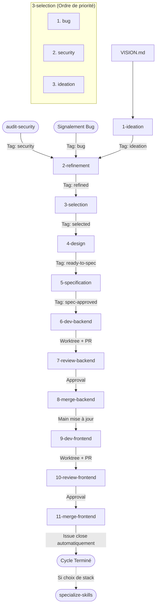

# Croissant Furtif 🥐🥷

Processus de développement logiciel (SDLC) autonome piloté par des compétences (**skills**) Antigravity.

Ce workflow utilise **exclusivement les commandes CLI standard `git` et GitHub (`gh`)**, sans aucun script customisé, pour garantir une portabilité maximale, une traçabilité totale sur GitHub et une isolation rigoureuse du code via Git worktrees.

---

## 🚀 Phases du Projet : Bootstrap vs Évolution

Le cycle s'adapte à la maturité du dépôt :

1. **Phase 0 — Démarrage / Bootstrap (Dépôt Neuf)** :
   - `1-ideation` détecte l'absence de stack définie dans [`ARCHITECTURE.md`](./ARCHITECTURE.md).
   - Il propose **3 architectures et choix de technologies complètes** (Backend, DB, Frontend, Tooling) alignées avec [`VISION.md`](./VISION.md).
   - L'équipe sélectionne, raffine et valide le choix.
   - Le skill [`specialize-skills`](.agents/skills/specialize-skills/SKILL.md) configure ensuite les skills de dev, review et sécurité avec les commandes et checklists pointues de la stack retenue.
2. **Phase 1 — Évolution Continue (Socle Établi)** :
   - `1-ideation` propose des fonctionnalités métier, améliorations UX et refactorings.
   - Les développeurs et reviewers virtuels exécutent les tâches avec une expertise ultra-ciblée.

---

## 🚦 Règle de Priorité Stricte

Les issues en attente de développement sont traitées selon un ordre hiérarchique strict :

$$\mathbf{bug} \succ \mathbf{security} \succ \mathbf{ideation}$$

1. **🔴 Priorité 1 — Bugs (`label: bug`)** : Tout bug bloquant ou anomalie signalée passe systématiquement en priorité absolue pour garantir la stabilité de l'application.
2. **🛡️ Priorité 2 — Sécurité (`label: security`)** : Les vulnérabilités détectées par le skill `audit-security` ou rapportées sont traitées immédiatement avant toute nouvelle fonctionnalité.
3. **💡 Priorité 3 — Idéation (`label: ideation` / `refined`)** : Les nouvelles fonctionnalités et améliorations architecturales issues de `VISION.md`.

---

## 🔄 Vue d'ensemble du cycle SDLC

---

## 🛠️ Les Skills du Workflow

Toutes les compétences sont situées dans `.agents/skills/` :

| Étape | Skill | Objectif | Outils CLI |
| :--- | :--- | :--- | :--- |
| **Setup** | [`specialize-skills`](.agents/skills/specialize-skills/SKILL.md) | Spécialise les skills selon la stack définie dans `ARCHITECTURE.md`. | `git diff`, `git commit` |
| **Audit** | [`audit-security`](.agents/skills/audit-security/SKILL.md) | Audit de sécurité périodique (secrets, failles, dépendances) et création d'issues `security`. | `git grep`, `git log`, `gh issue create` |
| **1** | [`1-ideation`](.agents/skills/1-ideation/SKILL.md) | Propose 3 idées variées issues de `VISION.md` (options de stack en phase bootstrap). | `gh issue create`, `gh label create` |
| **2** | [`2-refinement`](.agents/skills/2-refinement/SKILL.md) | Cadrage approfondi des bugs, failles ou idées et qualification en `refined`. | `gh issue list`, `gh issue edit` |
| **3** | [`3-selection`](.agents/skills/3-selection/SKILL.md) | Sélection par priorité stricte (`bug > security > ideation`) et passage en `selected`. | `gh issue list`, `gh issue edit` |
| **4** | [`4-design`](.agents/skills/4-design/SKILL.md) | Conception UI/UX si nécessaire (parcours, états, mockups) et passage en `ready-to-spec`. | `gh issue comment`, `gh issue edit` |
| **5** | [`5-specification`](.agents/skills/5-specification/SKILL.md) | Rédaction des spécifications séparées Backend et Frontend (`label: spec-approved`). | `gh issue comment`, `gh issue edit` |
| **6** | [`6-dev-backend`](.agents/skills/6-dev-backend/SKILL.md) | Implémentation Backend dans un Git worktree dédié et ouverture de la PR. | `git worktree`, `git commit`, `gh pr create` |
| **7** | [`7-review-backend`](.agents/skills/7-review-backend/SKILL.md) | Revue spécialisée backend (sécurité, archi, tests) et validation. | `gh pr diff`, `gh pr review` |
| **8** | [`8-merge-backend`](.agents/skills/8-merge-backend/SKILL.md) | Merge de la PR backend et nettoyage propre du worktree. | `gh pr merge`, `git worktree remove` |
| **9** | [`9-dev-frontend`](.agents/skills/9-dev-frontend/SKILL.md) | Implémentation Frontend dans un Git worktree dédié et ouverture de la PR (`Closes #ID`). | `git worktree`, `git commit`, `gh pr create` |
| **10** | [`10-review-frontend`](.agents/skills/10-review-frontend/SKILL.md) | Revue spécialisée frontend (UI/UX, réactivité, tests) et validation. | `gh pr diff`, `gh pr review` |
| **11** | [`11-merge-frontend`](.agents/skills/11-merge-frontend/SKILL.md) | Merge de la PR frontend, fermeture automatique de l'issue et nettoyage du worktree. | `gh pr merge`, `git worktree remove` |
