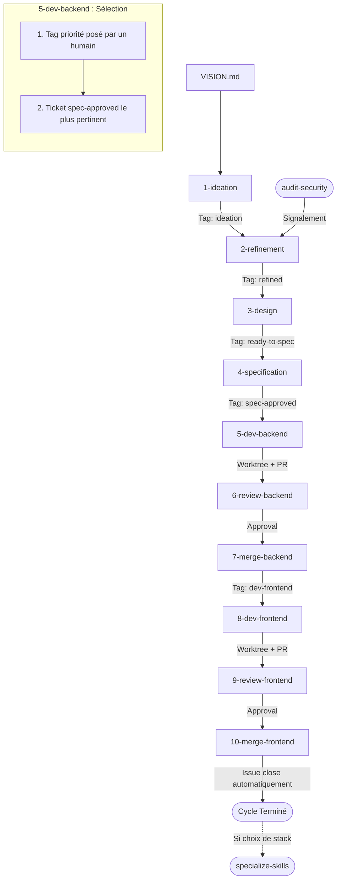

# Croissant Furtif 🥐🥷

Processus de développement logiciel (SDLC) autonome piloté par des compétences (**skills**) Antigravity.

Ce workflow utilise **exclusivement les commandes CLI standard `git` et GitHub (`gh`)**, sans aucun script customisé, pour garantir une portabilité maximale, une traçabilité totale sur GitHub et une isolation rigoureuse du code via Git worktrees.

---

## 🏷️ Règle Stricte des Labels (Single Stage Tag)

Pour une clarté maximale et éviter toute pollution du backlog :
1. **Un seul tag d'étape à la fois** : Chaque ticket GitHub ne porte qu'une seule étiquette d'état à un instant T. Dès qu'un ticket avance d'une étape, l'ancien tag est retiré (`--remove-label`) et le nouveau est appliqué (`--add-label`) :
   $$\text{ideation} \longrightarrow \text{refined} \longrightarrow \text{ready-to-spec} \longrightarrow \text{spec-approved} \longrightarrow \text{dev-backend} \longrightarrow \text{dev-frontend} \longrightarrow \text{CLOSED}$$
2. **Pas de tag `selected` superflu** : L'étape de développement (`5-dev-backend`) prend directement le ticket en `spec-approved` qui fait le plus de sens dans l'immédiat.
3. **Seuls autres tags autorisés (Priorité Humaine)** : Les seuls tags supplémentaires autorisés sur les issues sont les **tags de priorité posés par un humain** (ex: `priority`, `priority:high`, `priority:urgent`). Si un humain pose ce tag sur un ticket `spec-approved`, ce ticket est sélectionné en priorité absolue pour le développement.

---

## 🚀 Double Cycle : Bootstrap vs Évolution

1. **Phase 0 — Démarrage / Bootstrap (Dépôt Neuf)** :
   - `1-ideation` détecte l'absence de stack définie dans [`ARCHITECTURE.md`](./ARCHITECTURE.md).
   - Il propose **3 architectures complètes et mutuellement exclusives** sous le tag `ideation`.
   - Lorsque l'une des options est validée et passe en dev, les alternatives concurrentes sont fermées automatiquement.
   - Le skill [`specialize-skills`](.agents/skills/specialize-skills/SKILL.md) configure ensuite les skills de dev, review et sécurité avec les commandes et checklists de la stack retenue.
2. **Phase 1 — Évolution Continue (Socle Établi)** :
   - `1-ideation` propose des fonctionnalités métier, améliorations UX et refactorings incrémentaux basés strictement sur le code existant (pas de chaîne de 40 prérequis).
   - Le pipeline s'enchaîne de la spécification jusqu'au merge et à la fermeture automatique de l'issue.

---

## 🔄 Vue d'ensemble du cycle SDLC

---

## 🛠️ Les 10 Skills du Workflow

Toutes les compétences sont situées dans `.agents/skills/` :

| Étape | Skill | Label d'étape | Rôle & Action CLI |
| :--- | :--- | :--- | :--- |
| **1** | [`1-ideation`](.agents/skills/1-ideation/SKILL.md) | `ideation` | Propose 3 idées ou architectures immédiates issues de `VISION.md`. |
| **2** | [`2-refinement`](.agents/skills/2-refinement/SKILL.md) | `refined` | Cadrage technique, étude de faisabilité et critères d'acceptation. |
| **3** | [`3-design`](.agents/skills/3-design/SKILL.md) | `ready-to-spec` | Conception UI/UX (états, parcours, mockups) ou exemption explicite. |
| **4** | [`4-specification`](.agents/skills/4-specification/SKILL.md) | `spec-approved` | Rédaction des spécifications séparées Backend et Frontend. |
| **5** | [`5-dev-backend`](.agents/skills/5-dev-backend/SKILL.md) | `dev-backend` | Sélection (`spec-approved` + priorité humaine), worktree, tests et PR. |
| **6** | [`6-review-backend`](.agents/skills/6-review-backend/SKILL.md) | PR: `review-backend` | Revue experte backend (sécurité, tests, architecture) et approval. |
| **7** | [`7-merge-backend`](.agents/skills/7-merge-backend/SKILL.md) | `dev-frontend` | Merge backend, nettoyage du worktree et passage du ticket en front. |
| **8** | [`8-dev-frontend`](.agents/skills/8-dev-frontend/SKILL.md) | PR: `review-frontend`| Implémentation front dans un worktree et PR liée (`Closes #ID`). |
| **9** | [`9-review-frontend`](.agents/skills/9-review-frontend/SKILL.md) | PR: `frontend-approved`| Revue experte frontend (UX, réactivité, a11y, tests) et approval. |
| **10** | [`10-merge-frontend`](.agents/skills/10-merge-frontend/SKILL.md)| *CLOSED* | Merge frontend, fermeture automatique de l'issue et nettoyage final. |

### Compétences Support

- [`audit-security`](.agents/skills/audit-security/SKILL.md) : Audit périodique (fuites de secrets, failles de dépendances) créant des tickets de remédiation.
- [`specialize-skills`](.agents/skills/specialize-skills/SKILL.md) : Spécialise les commandes et checklists de test/lint/review selon la stack définie dans `ARCHITECTURE.md`.
