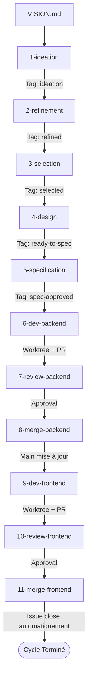

# Croissant Furtif 🥐🥷

Processus de développement logiciel (SDLC) autonome piloté par des compétences (**skills**) Antigravity.

Ce workflow utilise **exclusivement les commandes CLI `git` et GitHub (`gh`)**, sans aucun script customisé, pour garantir une portabilité maximale, une traçabilité totale sur GitHub et une isolation rigoureuse du code via Git worktrees.

---

## 🔄 Vue d'ensemble du cycle SDLC

---

## 🛠️ Les 11 Skills du Workflow

Toutes les compétences se trouvent dans le répertoire `.agents/skills/` :

| Étape | Skill | Objectif | Outils CLI |
| :--- | :--- | :--- | :--- |
| **1** | [`1-ideation`](.agents/skills/1-ideation/SKILL.md) | Analyse `VISION.md` et propose 3 idées variées sous forme d'issues GitHub (`label: ideation`). | `gh issue create`, `gh label create` |
| **2** | [`2-refinement`](.agents/skills/2-refinement/SKILL.md) | Cadrage approfondi, étude de faisabilité et passage en `refined`. | `gh issue list`, `gh issue edit` |
| **3** | [`3-selection`](.agents/skills/3-selection/SKILL.md) | Comparatif et sélection de la prochaine issue prioritaire à développer (`label: selected`). | `gh issue list`, `gh issue edit` |
| **4** | [`4-design`](.agents/skills/4-design/SKILL.md) | Conception UI/UX si nécessaire (parcours, états, mockups) et passage en `ready-to-spec`. | `gh issue comment`, `gh issue edit` |
| **5** | [`5-specification`](.agents/skills/5-specification/SKILL.md) | Rédaction des spécifications séparées Backend et Frontend (`label: spec-approved`). | `gh issue comment`, `gh issue edit` |
| **6** | [`6-dev-backend`](.agents/skills/6-dev-backend/SKILL.md) | Implémentation Backend dans un Git worktree dédié et ouverture de la PR. | `git worktree`, `git commit`, `gh pr create` |
| **7** | [`7-review-backend`](.agents/skills/7-review-backend/SKILL.md) | Revue spécialisée backend (sécurité, archi, tests) et validation. | `gh pr diff`, `gh pr review` |
| **8** | [`8-merge-backend`](.agents/skills/8-merge-backend/SKILL.md) | Merge de la PR backend et nettoyage propre du worktree. | `gh pr merge`, `git worktree remove` |
| **9** | [`9-dev-frontend`](.agents/skills/9-dev-frontend/SKILL.md) | Implémentation Frontend dans un Git worktree dédié et ouverture de la PR (`Closes #ID`). | `git worktree`, `git commit`, `gh pr create` |
| **10** | [`10-review-frontend`](.agents/skills/10-review-frontend/SKILL.md) | Revue spécialisée frontend (UI/UX, réactivité, tests) et validation. | `gh pr diff`, `gh pr review` |
| **11** | [`11-merge-frontend`](.agents/skills/11-merge-frontend/SKILL.md) | Merge de la PR frontend, fermeture automatique de l'issue et nettoyage du worktree. | `gh pr merge`, `git worktree remove` |
